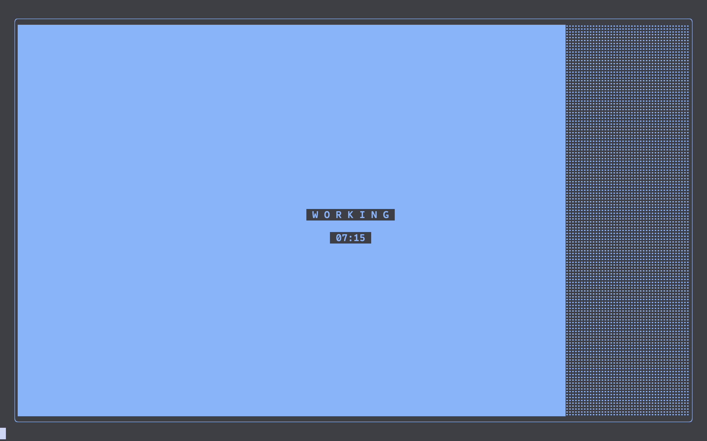

# Simple Pomodoro Timer 2

A Reskin of the previous SimplePomodoro, which is a simple pomodoro timer i made simply because i was tired of people overcomplicating pomodoro's and most timers not having a visual aspect to them. A lot of timers out there do fancy things like sessions and shit, but honestly, a good pomodoro just gives you the work time and the resting time and nothing more. I don't want to spend time setting up the perfect pomodoro config to tell me what i should be doing in a given session, i have notes for that, i just wanna get to work. Simple as that.

## Changes since 1.0:
- Timer now fills entire terminal, making it much easier to spot how long is left at a quick glance.
- Removed the percentage counter as it didn't really help me.

## Dependencies
The script only has a single dependency: `playsound`. Which is used to... you know, play the sound.

## Installation
Just `git clone https://github.com/Fiery-Penguin/SimplePomodoro `and `pip install playsound` to get the dependency if it's not already installed and you should be good to go. don't spend too much time on all this, go get some work done.

## To Do
- [x] Fix the bug where resizing can cause the timer to break due to out of bounds errors in arrays
- [ ] Add option to pause timer
- [ ] Make bell sound shorter
- [ ] Allow for muting bell
- [x] Add custom timer configurations that don't require changing hard-coded timings
- [ ] Have timer run in background and use terminal as a display independent of the timer itself
